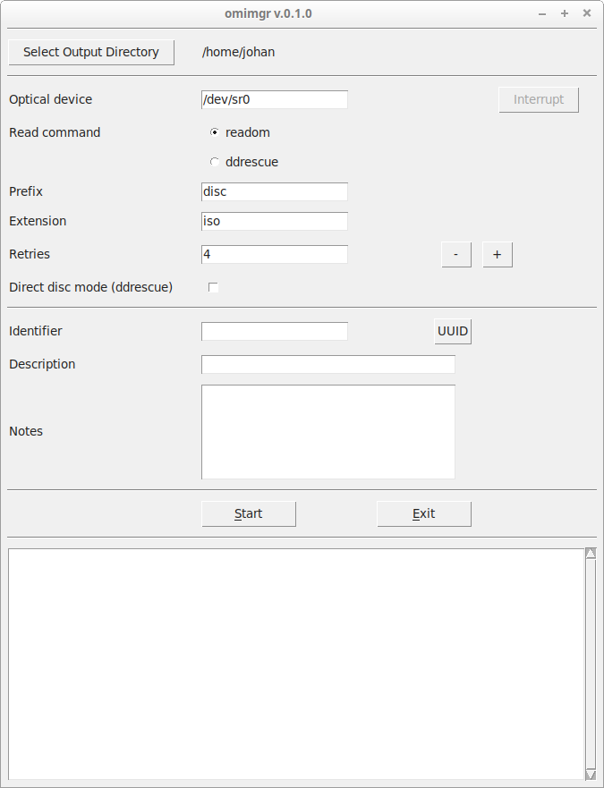
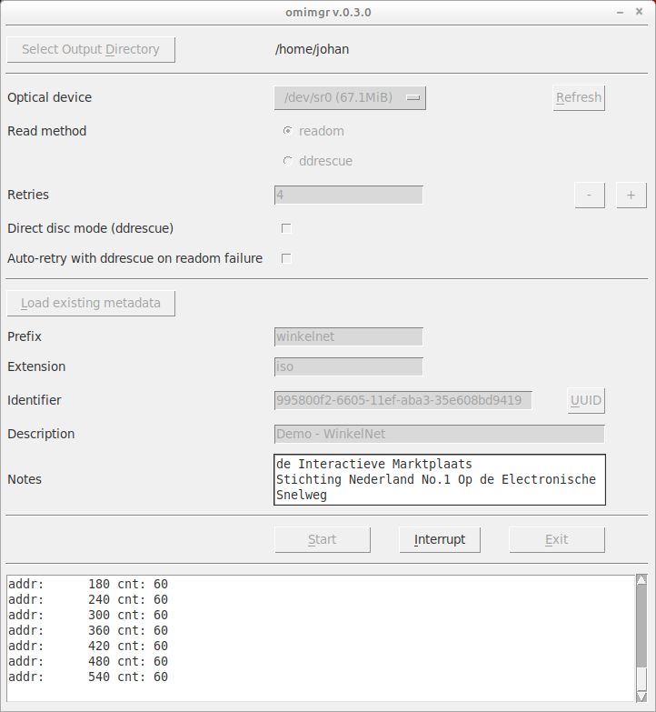
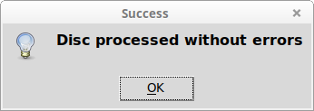
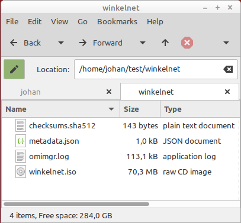
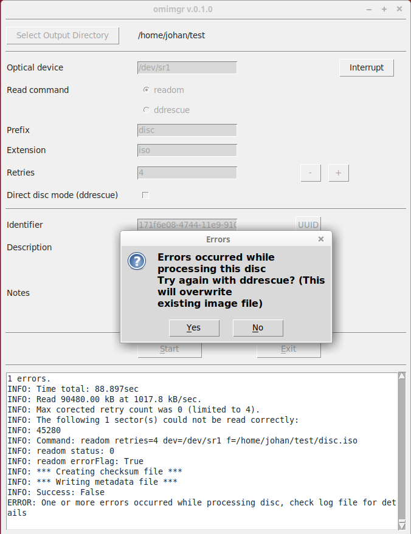
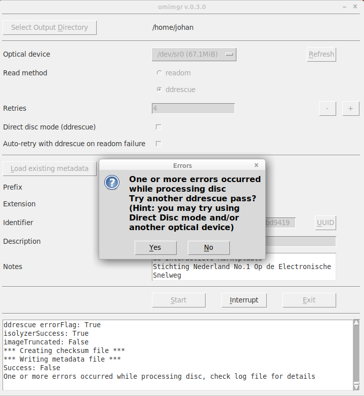

# omimgr

**Omimgr** provides a simple GUI-based workflow for making ISO images from optical media (CD-ROMs and DVDs). It wraps around the *readom* (part of [*Cdrkit*](https://en.wikipedia.org/wiki/Cdrkit)) and [*ddrescue*](https://linux.die.net/man/1/ddrescue) tools. After the imaging is done it also generates a checksum file with SHA-512 hashes of the extracted files. 

## System requirements

*Omimgr* is currently only available for Linux. So far it has been tested with Ubuntu 18.04 LTS (Bionic) and Linux Mint 18.3, which is based on Ubuntu 16.04 (Xenial). In addition it has the following dependencies:

- **Python 3.2 or more recent** (Python 2.x is not supported)

- **Tkinter**. If *tkinter* is not installed already, you need to use the OS's package manager to install (there is no PyInstaller package for *tkinter*). If you're using *apt* this should work:

        sudo apt-get install python3-tk

- **readom**, which is part of the *wodim* package. Use the following command to install it:

        sudo apt install wodim

- **ddrescue**, which can be installed using:

        sudo apt install gddrescue

## Installation

### Global install

For a global (all-users) installation run the following command:

    sudo pip3 install omimgr

Then run:

    sudo omimgr-config

If all goes well this should result in the following output:

    INFO: writing configuration file /etc/omimgr/omimgr.json
    INFO: creating desktop file /usr/share/applications/omimgr.desktop
    INFO: omimgr configuration completed successfully!

### User install

Use the following command for a single-user installation:

    pip3 install --user omimgr

Then run:

    ~/.local/bin/omimgr-config

Result:

    INFO: writing configuration file /home/johan/.config/omimgr/omimgr.json
    INFO: creating desktop file /home/johan/.local/share/applications/omimgr.desktop
    INFO: omimgr configuration completed successfully!

*Omimgr* is now ready to roll!

## Basic operation

You can start *omimgr* from the OS's main menu (in Ubuntu 18.04 the *omimgr* item is located under *System Tools*). Depending on your distro, you might get an "Untrusted application launcher" warning the first time you activate the shortcut. You can get rid of this by clicking on "Mark as Trusted". On startup the main *omimgr* window appears:

Use the *Select Output Directory* button to navigate to an (empty) directory where the output files are to be stored. The interface allows you to specify the following options:

|Option|Description|
|:-|:-|
|**Optical Device**|The optical devices that is used (default: `/dev/nst0`).|
|**Read command**|The command that is used to read the disc (default: `readom`).|
|**Prefix**|Output prefix (default: `disc`).|
|**Extension**|Output file extension (default: `iso`).|
|**Retries**|Maximum number of retries (default: `4`).|
|**Direct disc mode**|Check this option to read a disc in direct disc mode (setting only has effect with *ddrescue*) (disabled by default).|
|**Identifier**|Unique identifier. You can either enter an existing identifier yourself, or press the *UUID* button to generate a [Universally unique identifier](https://en.wikipedia.org/wiki/Universally_unique_identifier).|
|**Description**|A text string that describes the tape (e.g. the title that is written on its inlay card).|
|**Notes**|Any additional info or notes you want to record with the disc.|

Press the *Start* button to start imaging a disc. You can monitor the progress of the extraction procedure in the progress window:

Note that the screen output is also written to a log file in the output directory. A prompt appears when the imaging is finished:

If the imaging finished without any errors, the output directory now contains the following files:

Here, **handbook.iso** is the created ISO image; **checksums.sha512** contains the SHA512 checksums of the image, **metadata.json** contains some basic metadata and **omimgr.log** is the log file.

If *readom*'s attempt to read the disc resulted in any errors, *omimgr* prompts the user to try again with *ddrescue*:

After clicking *Yes*, *omimgr* will delete the disc image that was created by *readom*, and then start *ddrescue*. If *ddrescue* also exits with any errors, it is possible to do one or more addition passes with *ddrescue*:

After clicking *Yes*, you can activate *Direct Disc* mode, or select another optical drive. Press the *Start* button again to start reading the disc. Importantly, *omimgr* does not delete the existing disc image in this case, but it will update it with any additional data that can be rescued from the disc.

## Suggested workflow

In general *readom* is the preferred tool to read a CD-ROM or DVD. However, *readom* does not cope well with discs that are degraded or otherwise damaged. Because of this, the suggested workflow is to first try reading the disc with *readom*. If this results in any errors, try *ddrescue*. It is possible to run multiple subsequent passes with *ddrescue*. If *ddrescue* fails with errors, it sometimes helps to re-run it in *Direct disc* mode (which can be selected from *omimgr*'s interface). The results can often be further improved by running multiple *ddrescue* passes with different optical devices (e.g. a few different external USB drives).

## Interrupting readom or ddrescue

Press the *Interrupt* button to interrupt any running *readom* or *ddrescue* instances. This is particularly useful for *ddrescue* runs, which may require many hours for discs that are badly damaged. Note that interrupting *ddrescue* will not result in any data loss. If you re-run *omimgr* with *ddrescue* on an image that was previously interrupted, it will simply pick up on where the interrupted run stopped. 

## Metadata file

The file *metadata.json* contains metadata in JSON format. Below is an example:

    {
        "acquisitionEnd": "2019-03-15T19:03:49.332433+01:00",
        "acquisitionStart": "2019-03-15T19:03:39.979201+01:00",
        "checksumType": "SHA-512",
        "checksums": {
            "handbook.iso": "20eb93d8d0fa7fe24bd4debba6a0f1556c09a1b1c3a753bbf0d39445e72c3569e69e813c845629e1165ce57aa6d19ccb2b1a9df1a88fea9e7e464f6893fc7d02"
        },
        "description": "Preservation Management of Digital Materials",
        "extension": "iso",
        "identifier": "6f816238-474c-11e9-9105-dc4a3e413173",
        "interruptedFlag": false,
        "maxRetries": "4",
        "notes": "",
        "omDevice": "/dev/sr1",
        "omimgrVersion": "0.1.0",
        "prefix": "handbook",
        "readCommand": "readom",
        "readCommandLine": "readom retries=4 dev=/dev/sr1 f=/home/johan/test/handbook.iso",
        "rescueDirectDiscMode": false,
        "successFlag": true
    }

## Configuration file

*Omimgr*'s internal settings (default values for output file names, the optical device, etc.) are defined in a configuration file in Json format. For a global installation it is located at */etc/omimgr/omimgr.json*; for a user install it can be found at *~/.config/omimgr/omimgr.json*. The default configuration is show below:

    {
        "checksumFileName": "checksums.sha512",
        "defaultDir": "",
        "extension": "iso",
        "logFileName": "omimgr.log",
        "metadataFileName": "metadata.json",
        "omDevice": "/dev/sr0",
        "prefix": "disc",
        "readCommand": "readom",
        "rescueDirectDiscMode": "False",
        "retries": "4",
        "timeZone": "Europe/Amsterdam"
    }

You can change *omimgr*'s default settings by editing this file. Most of the above settings are self-explanatory, with the exception of the following:

- **defaultDir**: this allows you to change the default file path that is opened after pressing *Select Output Directory*. By default *omimgr* uses the current user's home directory. However, if *defaultDir* points to a valid directory path, that directory is used instead.

- **timeZone**: time zone string that is used to correctly format the *acquisitionStart* and *acquisitionEnd* date/time strings. You can adapt it to your own location by using the *TZ database name* from [this list of tz database time zones](https://en.wikipedia.org/wiki/List_of_tz_database_time_zones).

If you accidentally messed up the configuration file, you can always restore the original one by running the *omimgr-config* tool again.

## Uninstalling omimgr

To remove *omimgr*, first run the *omimgr-config* with the `--remove` flag to remove the configuration file and the start menu and desktop files. For a global install, run:

    sudo omimgr-config --remove

For a user install, run:

    ~/.local/bin/omimgr-config --remove

The resulting output (shown below for a user install):

    INFO: removing configuration file /home/johan/.config/omimgr/omimgr.json
    INFO: removing configuration directory /home/johan/.config/omimgr
    INFO: removing desktop file /home/johan/.local/share/applications/omimgr.desktop
    INFO: omimgr configuration completed successfully!

Then remove the Python package with following command (global install):

    sudo pip3 uninstall omimgr

For a user install use this:

    pip3 uninstall omimgr

## Contributors

Written by Johan van der Knijff. Some parts of the code that processes ddrescue's and readom's terminal output were adapted from [DDRescue-GUI](https://launchpad.net/ddrescue-gui) by Hamish McIntyre-Bhatty.

## License

*Omimgr* is released under the  Apache License 2.0.
